# 🕵️ LoneWolf Digital Forensics Investigation

## 📌 Project Overview

This project demonstrates a complete **digital forensic investigation workflow** performed using forensic analysis methodologies and artifact examination techniques.  

The investigation focuses on:
- User & Operating System analysis
- Installed programs and USB activity
- Web artifact examination
- Timeline reconstruction
- System architecture investigation

The project was organized and documented in a professional structure to simulate a real-world forensic investigation environment.

---

# 🎯 Objectives

- Perform forensic analysis on collected system artifacts
- Investigate user behavior and activity traces
- Reconstruct activity timelines
- Analyze suspicious browser artifacts
- Document findings in a structured forensic format
- Demonstrate practical digital forensics skills

---

# 🛠️ Tools & Technologies Used

- Autopsy
- Windows Forensics Techniques
- Timeline Analysis
- Browser Artifact Analysis
- USB Activity Investigation
- Digital Evidence Documentation

---

# 📂 Project Structure

```text
LoneWolf-Digital-Forensics/
│
├── presentation/
│
├── report/
│
├── screenshots/
│   │
│   ├── document_timeline_analysis/
│   │   ├── document_timeline_creation.png
│   │   ├── ws-wh_timeline_1.png
│   │   ├── ws-wh_timeline_2.png
│   │   └── ws-wh_timeline_3.png
│   │
│   ├── phase-programs_and_activity/
│   │   ├── installed_programs.png
│   │   └── usb_device_activity.png
│   │
│   ├── phase-user_and_os_analysis/
│   │   ├── os_information.png
│   │   └── user_account_analysis.png
│   │
│   ├── system_architecture/
│   │   └── system_architecture.png
│   │
│   └── web_artifacts/
│       ├── historyofsuspect.png
│       ├── weapons_related artifact_1.png
│       └── weapons_related artifact_2.png
│
├── LICENSE
└── README.md
```

---

# 🔍 Investigation Phases

---

# 👤 Phase — User & OS Analysis

This phase focuses on identifying operating system information and analyzing user account details from the forensic evidence.

---

## 🖥️ Operating System Information

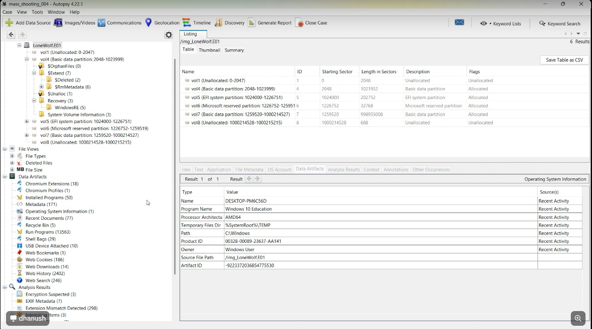

### 📄 Analysis
The operating system details were extracted to identify the system environment involved in the investigation.

### 🔎 Significance
Operating system analysis helps investigators understand:
- System configuration
- Installed environment
- User interaction context

---

## 👥 User Account Analysis

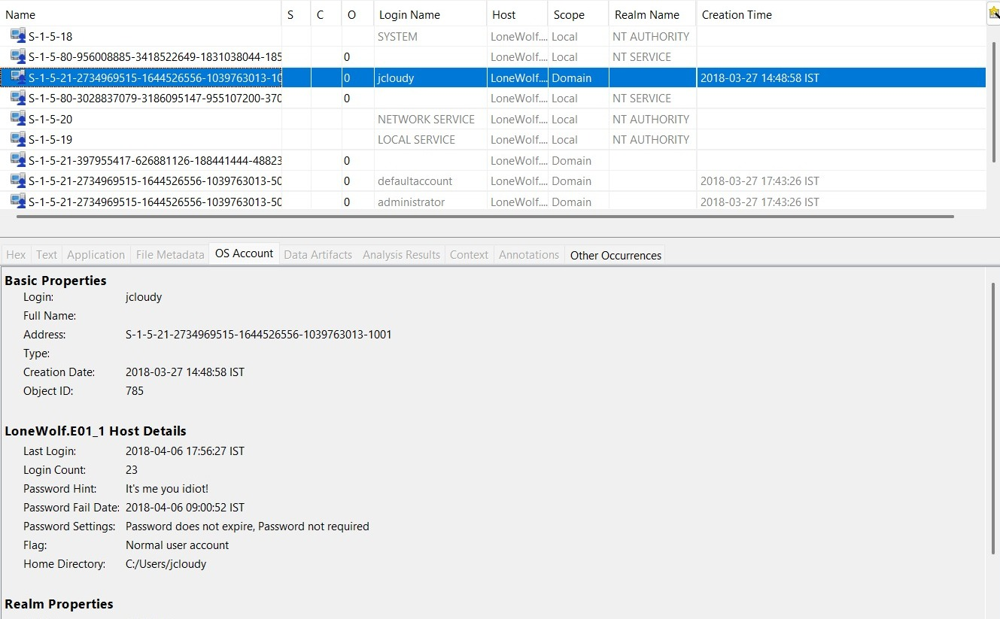

### 📄 Analysis
User account artifacts were analyzed to identify system users and possible user activity traces.

### 🔎 Significance
User account investigation assists in:
- User attribution
- Activity correlation
- Access tracking

---

# 💻 Phase — Programs & Device Activity

This phase investigates installed applications and removable device activity.

---

## 📦 Installed Programs

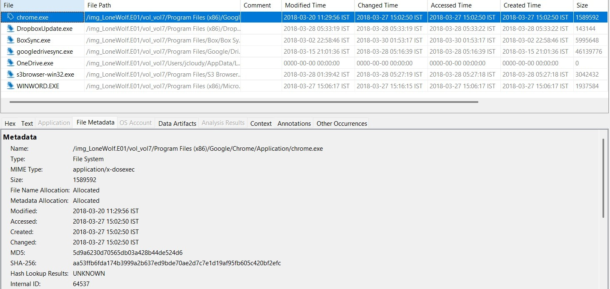

### 📄 Analysis
Installed software entries were examined to identify potentially suspicious or relevant applications.

### 🔎 Significance
Installed program analysis may reveal:
- Unauthorized software
- Recently installed applications
- Tools related to suspicious activity

---

## 🔌 USB Device Activity

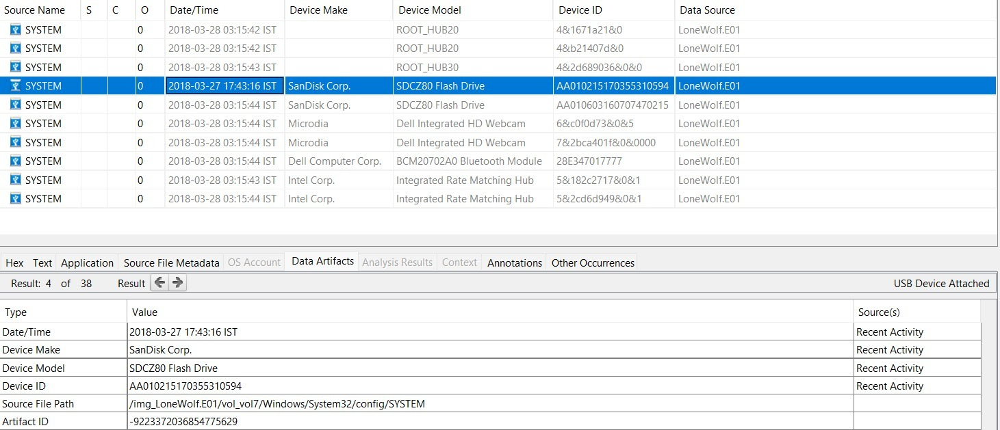

### 📄 Analysis
USB connection artifacts were analyzed to identify removable storage device usage.

### 🔎 Significance
USB forensic analysis helps determine:
- External device usage
- Possible evidence transfer
- Timeline correlation

---

# 🌐 Phase — Web Artifact Investigation

This phase focuses on browser-related forensic evidence and online activity traces.

---

## 🌍 Browser History Investigation

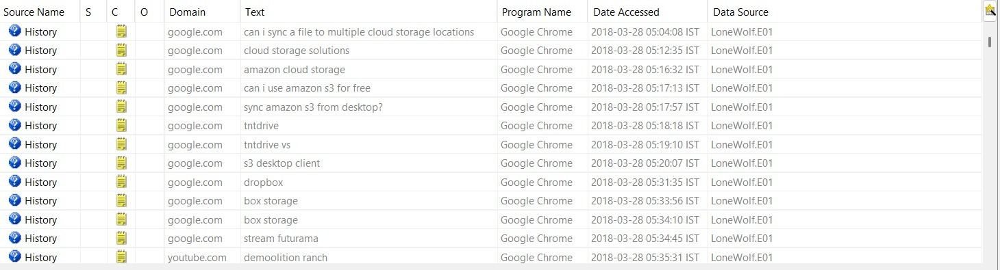

### 📄 Analysis
Browser history artifacts were examined to identify suspicious online activity.

### 🔎 Significance
Web history investigation assists in:
- Behavioral analysis
- Intent identification
- Activity reconstruction

---

## 🔫 Weapon-Related Artifact — Part 1

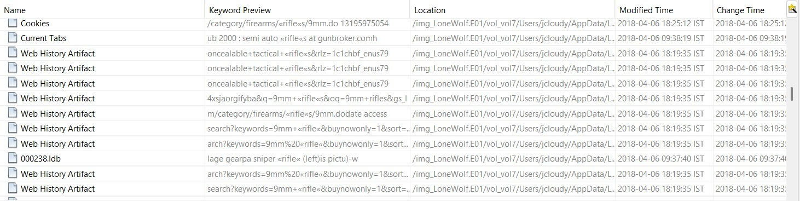

### 📄 Analysis
Browser artifacts indicated searches and interactions related to weapon-related content.

### 🔎 Significance
The identified searches may indicate focused suspicious activity requiring deeper investigation.

---

## 🔫 Weapon-Related Artifact — Part 2

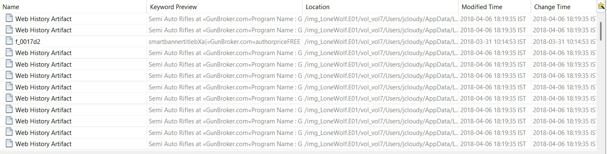

### 📄 Analysis
Additional suspicious web artifacts were identified during browser analysis.

### 🔎 Significance
The continuation of similar searches strengthens activity correlation and investigative findings.

---

# 🕒 Phase — Timeline Reconstruction & Document Analysis

This phase reconstructs chronological activity from system artifacts and document traces.

---

## 📄 Document Timeline Creation

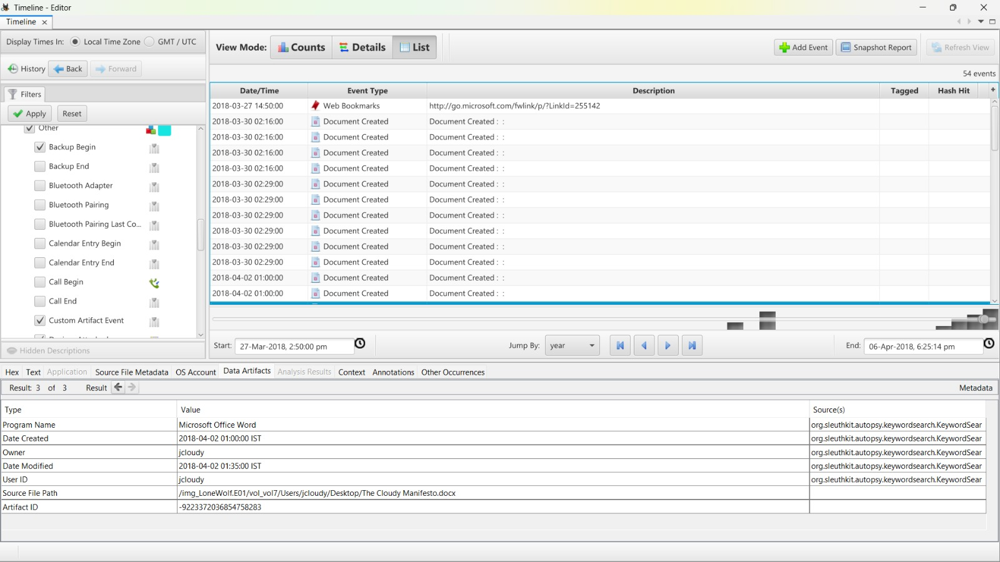

### 📄 Analysis
Document activity timestamps were reconstructed to analyze chronological behavior.

### 🔎 Significance
Timeline reconstruction helps identify:
- User activity flow
- File interaction patterns
- Evidence chronology

---

## ☁️ Timeline Activity — Part 1

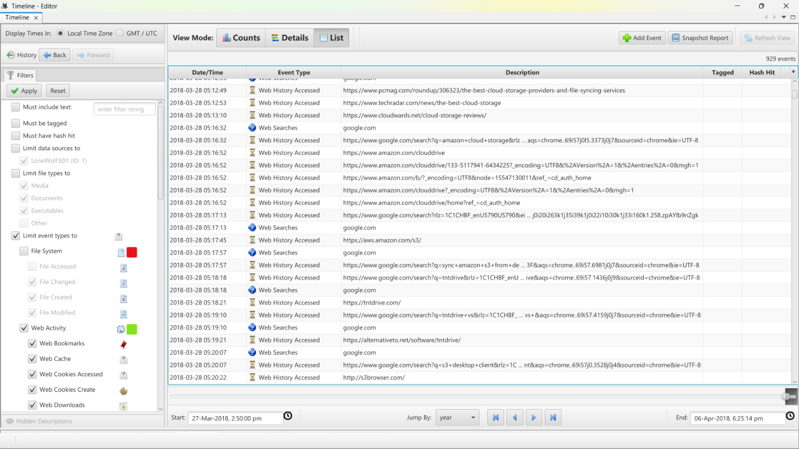

### 📄 Analysis
The timeline analysis module revealed chronological event sequences.

### 🔎 Significance
Helps correlate user activity with system events.

---

## ☁️ Timeline Activity — Part 2

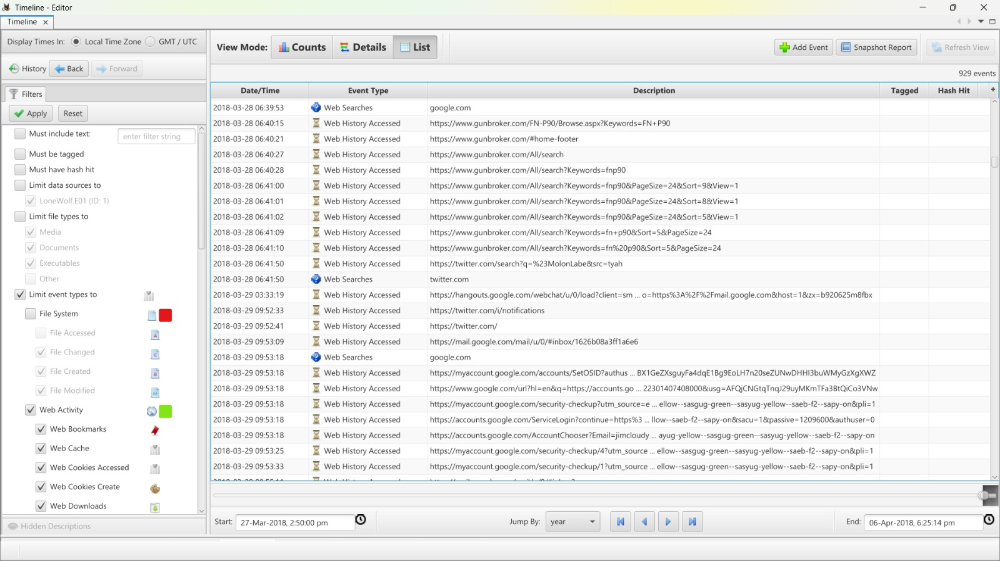

### 📄 Analysis
Additional event records were analyzed to continue activity reconstruction.

### 🔎 Significance
Provides extended insight into user interaction patterns.

---

## ☁️ Timeline Activity — Part 3

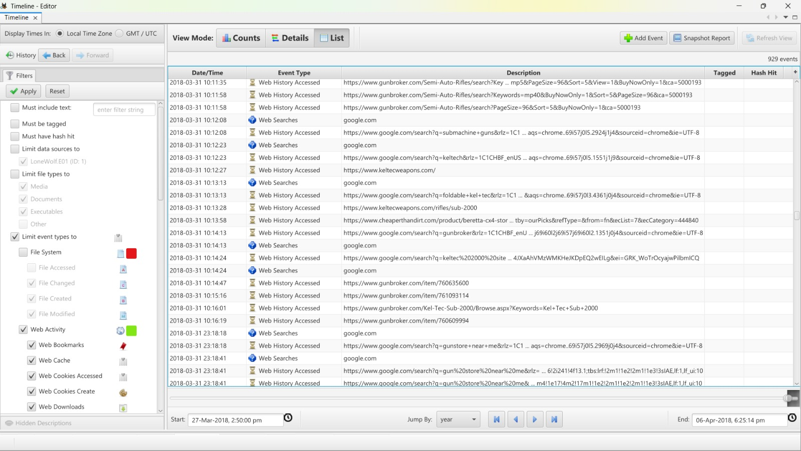

### 📄 Analysis
Final timeline artifacts were reviewed to complete chronological analysis.

### 🔎 Significance
Completes forensic reconstruction of system activity.

---

# 🖥️ System Architecture Analysis

---

## 🏗️ System Architecture

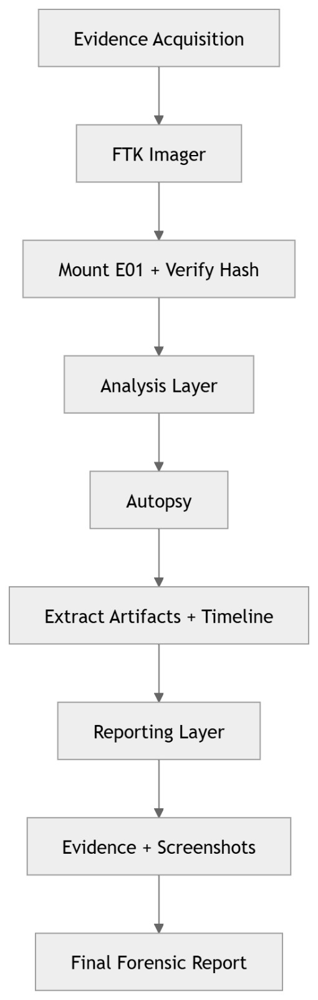

### 📄 Analysis
System architecture information was examined to understand hardware and system structure.

### 🔎 Significance
Architecture analysis assists in:
- Environment identification
- Compatibility understanding
- Investigation context

---

# 📑 Key Findings

- User activity traces were successfully reconstructed
- USB device interaction evidence was identified
- Browser artifacts revealed suspicious searches
- Timeline reconstruction correlated multiple system events
- Installed applications and user artifacts were documented

---

# 🚀 Skills Demonstrated

- Digital Forensics Investigation
- Timeline Reconstruction
- Artifact Analysis
- Browser Forensics
- USB Forensics
- Documentation & Reporting
- Evidence Correlation

---

# 📌 Conclusion

This project demonstrates practical application of digital forensic investigation methodologies through structured evidence analysis and artifact examination.

The investigation highlights how forensic artifacts can be used to reconstruct user behavior, identify suspicious activity, and document findings in a professional investigation format.

---

# 👨‍💻 Author

**Yashraj & Dhanush and Team**

Aspiring Cybersecurity SOC & Digital Forensics Enthusiast

---
